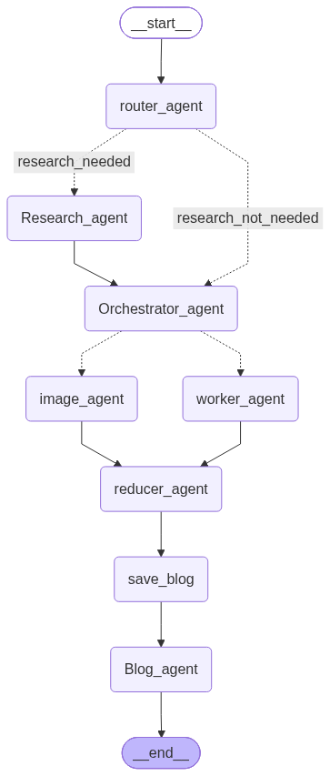

# AgentWriter AI



## 1. Project Goal

AgentWriter AI is a multi-agent system built using LangGraph and LangChain that takes a user's topic/query and automatically generates a complete, well-structured blog or article.

The system workflow follows a clear pipeline:
**Understand → Research → Plan → Write → Add Images/Citations → Combine → Review → Deliver**

## 2. User Input & Output

**Required Input:** A topic or query.

**System Output:** A complete, publication-ready blog containing:
- Title & Introduction
- Multiple well-structured sections
- Relevant content & Conclusion
- Citations (when research is used)
- Generated Images (when required)

## 3. The Agent Team (Components)

### 🚦 Router Agent
**Responsibility:** Understand the user request and determine the required workflow.
- Decides if the topic requires research, current information, or if it is a standard generation request.

### 🔍 Research Agent
**Responsibility:** Handle data collection when research is required (powered by Tavily).
- Generates search queries and searches relevant sources.
- Collects information, extracts useful facts, and removes irrelevant data to produce a concise research report.

### 📋 Orchestrator (Planner)
**Responsibility:** Create the detailed execution plan for the blog.
- Decides the number of sections, what each section is about, target word counts, and whether specific sections require research, citations, code, or images.
- *Example:* Section 2 might require Research and an Image, while Section 3 might require Research and Code.

### ✍️ Worker Agent
**Responsibility:** Write individual sections according to the Orchestrator's plan.
- If there are 7 sections, 7 Worker Agents are executed in parallel to drastically speed up generation.

### 🎨 Image Agent
**Responsibility:** Handle sections that require illustrations.
- Determines image requirements, generates high-quality prompts, and generates the images (powered by Gemini) to be associated with specific sections.

### 🧩 Reducer
**Responsibility:** Take all Worker and Image outputs and combine them into one complete blog.
- Puts sections in the correct order, removes unnecessary duplication, maintains consistency, and seamlessly integrates citations and images.

---

## 🛠️ Setup & Installation

1. **Clone the repository** and install dependencies (e.g., `langchain`, `langgraph`, `python-dotenv`, `tavily-python`, `google-genai`).

2. **Configure Environment Variables**:
   Create a `.env` file in the root directory. The system features robust rate-limit handling with exponential backoff and round-robin key switching.

   ```env
   # Text Generation Keys (Groq)
   groq-apikey="your_groq_key_1"
   groq-apikey2="your_groq_key_2"

   # Web Search Key (Tavily)
   tavily_search_api_key="your_tavily_key"

   # Image Generation Keys (Gemini)
   gemini_api_key="your_gemini_key_1"
   gemini_api_key_2="your_gemini_key_2"
   gemini_api_key_3="your_gemini_key_3"
   gemini_api_key_4="your_gemini_key_4"
   ```

## 🚀 Usage (Observability)

1. Open `main.py` and modify the `user_topic` inside the `invoke` call at the bottom.
2. Run the pipeline:
   ```bash
   python main.py
   ```
3. The system prints step-by-step progress to the console, allowing you to observe every step of the workflow. Once complete, it saves the final Markdown blog to a `.md` file and images to the `generated_images/` directory.
